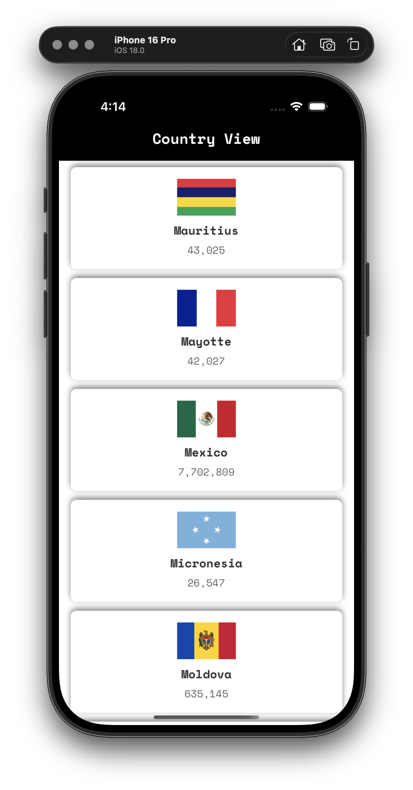
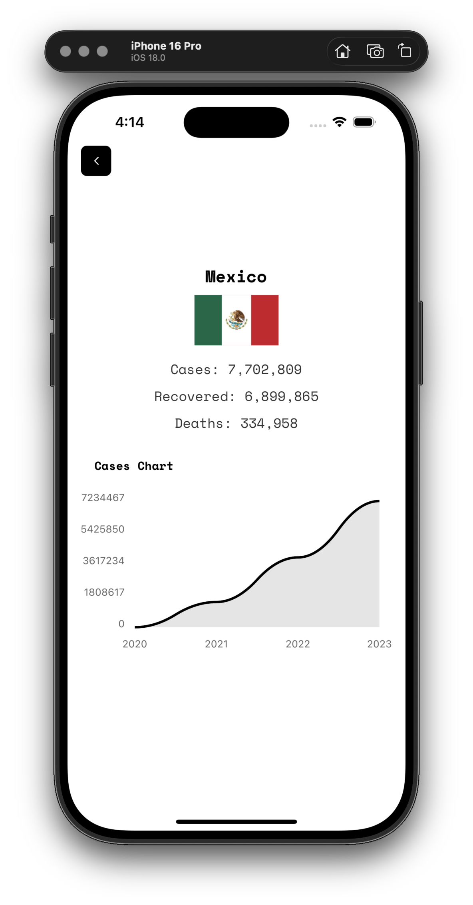

# COVID-19 Data App

A React Native application built with Expo that displays COVID-19 statistics for countries worldwide.

## Features

- Browse a list of all countries with COVID-19 data
- View detailed statistics for each country
- Historical data visualization with charts
- Clean, minimal interface with Space Mono font

## Screenshots

### Main Screen


### Country Detail


## Installation

1. Clone the repository
```bash
git clone https://github.com/Jozefhdez/covid-data.git
cd covid-data
```

2. Install dependencies
```bash
npm install
```

3. Start the development server
```bash
npx expo start
```

## Technologies

- React Native
- Expo
- TypeScript
- Axios for API requests
- react-native-chart-kit for data visualization
- disease.sh API for COVID-19 data